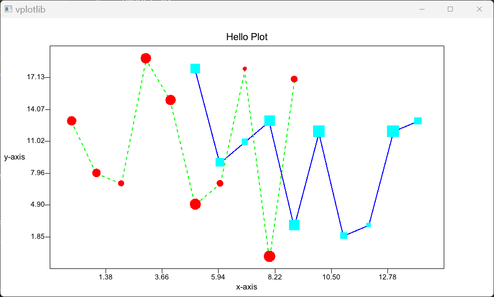

# VPlotLib

Plotting library for V, inspired by Python's `matplotlib`

### Quick example:

```v
import vplotlib as vpl
import gx

fn main() {
	x, x1, y, y1, s := ... // inputs

	mut fig := vpl.new_figure(rows: 1)!
	fig.plot([
		vpl.line(x: x1, y: y1),
		vpl.line(x: x, y: y, color: gx.green, line_type: .dashed),
		vpl.scatter(x: x, y: y, s: s, color: gx.red),
		vpl.scatter(x: x1, y: y1, s: s, color: gx.cyan, marker: .square),
	])!
	fig.title('Hello Plot')
	fig.xlabel('x-axis')
	fig.ylabel('y-axis')
	fig.show()
}
```



#### Sub Plots Example

```v
mut fig := vpl.figure(rows: 2, cols: 2, title: 'Subplot Example')
fig.add(i: 0, j: 0, plots: [vpl.line(x: x1, y: y1)])
fig.add(i: 0, j: 1, plots: [vpl.line(x: x, y: y, color: gx.green, line_type: .dashed)])
fig.add(i: 1, j: 0, plots: [vpl.scatter(x: x, y: y, s: s, color: gx.red)])
fig.add(
	i: 1
	j: 1
	plots: [
		vpl.scatter(x: x1, y: y1, s: s, color: gx.cyan, marker: .square),
	]
	title: 'SubPlot11'
	xlabel: 'x-axis'
	ylabel: 'y-axis'
)

fig.add(i: 0, j: 0, title: 'SubPlot00', xlabel: 'x-axis', ylabel: 'y-axis')
fig.add(i: 0, j: 1, title: 'SubPlot01', xlabel: 'x-axis', ylabel: 'y-axis')
fig.add(i: 1, j: 0, title: 'SubPlot10', xlabel: 'x-axis', ylabel: 'y-axis')

fig.show()
```

