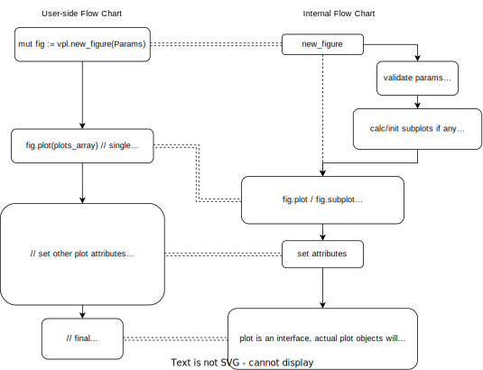

## CONTRIBUTING

### To Add a new plot

Suppose anybody wants to add a new type of plot i.e. `violin` plot, then do the following:
- Add a new file `src/violin.v`. Ideally this is the only file that needs to be added/edited.
- This file must contain the following:
  1. A struct that implements `interface Plot`. The struct need not be public. The name of struct should be like `ViolinPlot`
  2. A public function with same name as the plot and returns `ViolinPlot`, i.e. `pub fn violin(ViolinParams) ViolinPlot`. This function will be used by end-user.
  3. A pub struct like `ViolinParams` that helps taking inputs and setting default values required by the plot.
  4. Finally a private function that contains actual logic to draw the plot. i.e. `fn (plot &ViolinPlot) draw(ctx &gg.Context, sfig &SubFigure)`
- Add an example for the new plot in `examples/` and test it.
- Ideally this should be enough and no other files needs to be touched.